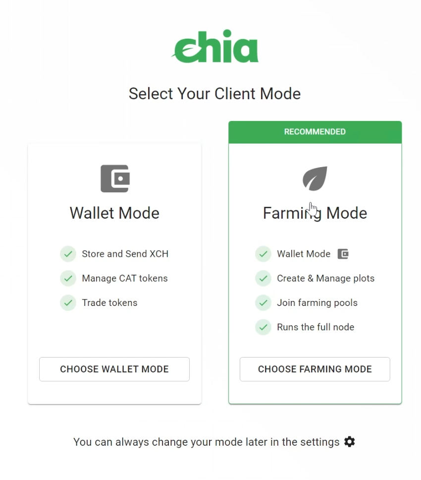
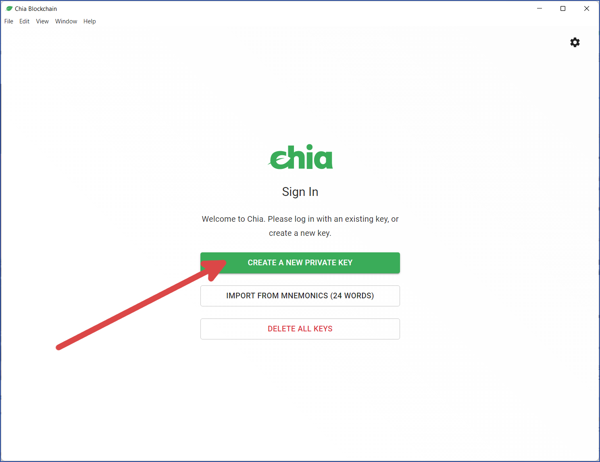
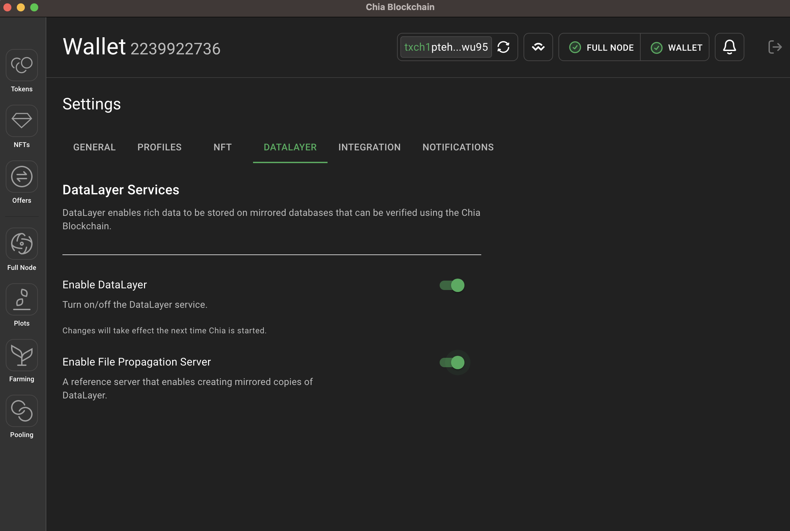
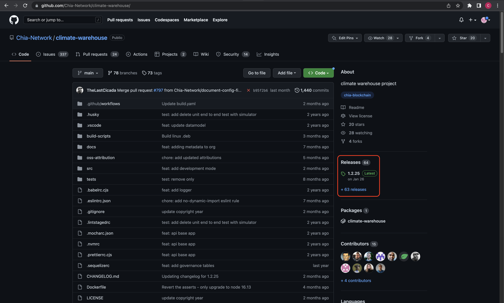
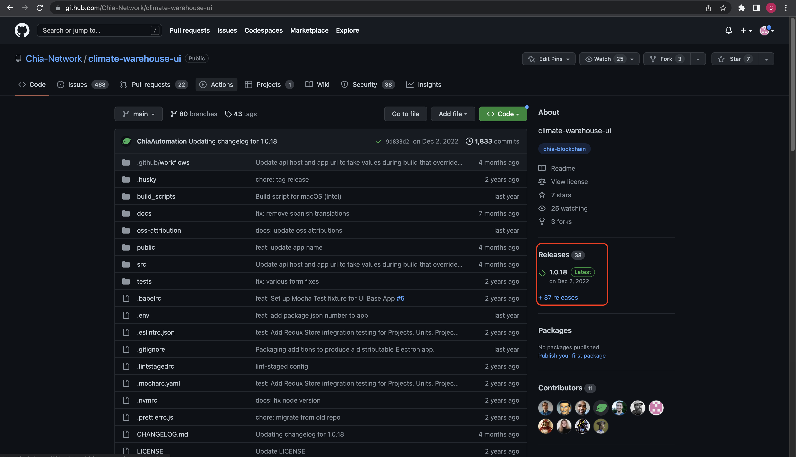
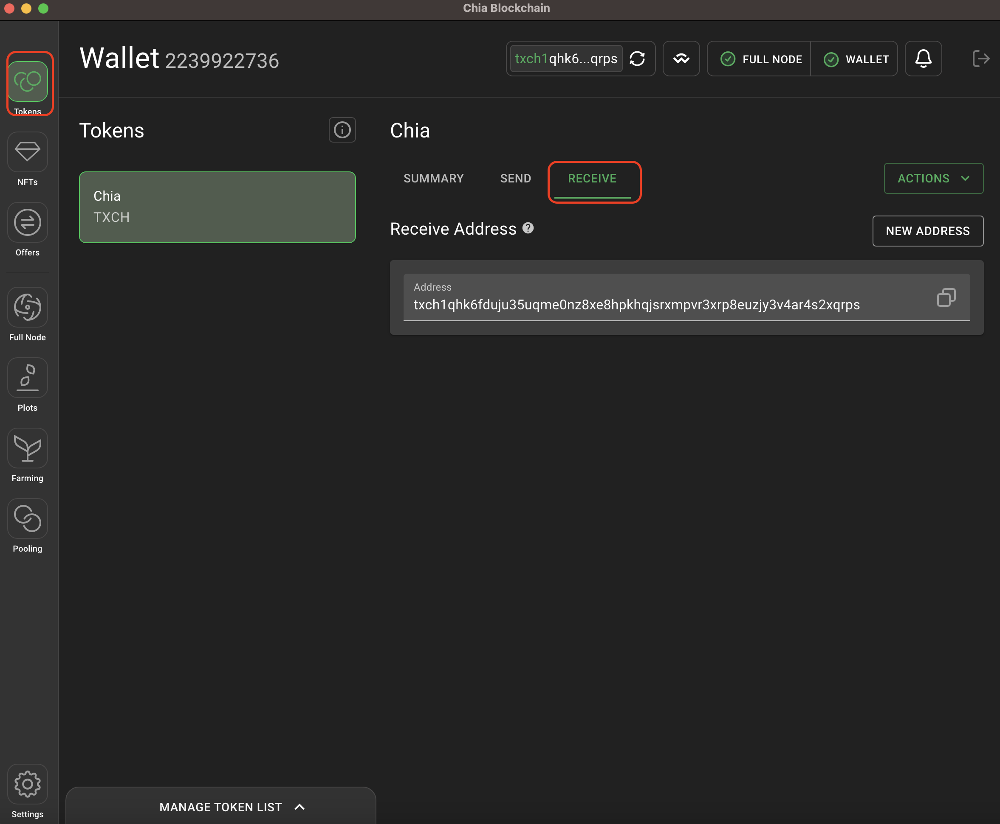

## Climate Action Data Trust (CADT) Local Installation Guide

The purpose of this document is to guide a carbon registry through the deployment and installation steps required to set up an instance of the CADT on a desktop computer or laptop.  The installation will be on the same machine you are sitting at (or remotely connected to using a desktop interface, such as RDP or VNC) and will use a GUI wherever possible.   

If you are trying to set up the CADT to run on a cloud network, on a headless Linux server, or strictly using the command line with no GUI, please reference the cloud installation guide.

## Contents

* Architecture overview
* Installation overview
* Install Chia blockchain software
* Install CADT API server
* Install CADT UI (optional)
* Request XCH cryptocurrency
* Setting up a “test” instance

## Architecture Overview

Coming soon

## Installation Overview

Deploying the CADT requires installing both the Chia blockchain software and the CADT API server software. For local deployments, both pieces of software are always installed on the same machine. The machine should have at the least the following minimum specs:

* Quad core 1.5Ghz CPU (64 bit)
* 4 GB ram
* 500 GB disk space
* Python version 3.7-3.9

By installing both of the above pieces of software onto a machine, you will have created your local instance of the CADT and can begin submitting data to the instance. 

Please note that the CADT software is meant to be running 24/7. If the local machine needs to restart or goes down for any reason, the software will need to be manually restarted.  Also note that this guide is operating system agnostic, but is generally written from the perspective of a Windows installation.  

## Install Chia blockchain software

To get started, first go to [https://www.chia.net/downloads/](https://www.chia.net/downloads/) and select the download option for your OS. 

Once the package has been downloaded, simply follow on screen prompts to launch the Chia application. When the application finishes launching, you will be prompted with a screen that asks whether you want to run Chia in “Farming Mode” or “Wallet Mode”.

“Farming Mode” enables the software to store a copy of the blockchain, use the wallet, and use DataLayer. The blockchain currently requires about 100gb of disk space to store. 

“Wallet Mode” enables the software to use the wallet and use DataLayer. 

It is recommended to run Chia in “Farming Mode”, but if storage space is a concern, “Wallet Mode” will provide all the necessary functionality for CADT without the need to store a copy of the blockchain. 

Once the mode has been selected, you will be prompted to create a new private key, or import an existing one. 

By clicking “create a new private key”, the software will automatically create a new cryptographic key pair that is stored on the local machine. 

The software will then show a screen with 24 random words in a specific order. This is your _mnemonic device_ and can be used to recover the keys if they are lost, or if you want to move keys securely to another machine. Write this mnemonic down and save it in a very secure and safe location. 

Once your private key has been created, your Chia software will now run automatically on the machine. 

If you selected “Farming Mode”, the software will copy the blockchain to your machine. This process can take anywhere from a few days to a few weeks depending on many factors. You can track the progress in the Chia GUI by looking at the “Full Node” tab and viewing the top left “Status” tile (it will show green text “Synced” once completed). The CADT application will work fine while the blockchain is syncing, so there’s no need to wait on this to complete, just let it run in the background. 

If you selected “Wallet Mode”, you will need to turn on Chia DataLayer services (DataLayer and File Propagation Server) which can be found in the settings tab, and in the DataLayer section. Once these services have been turned on, restart Chia to allow the setting to take effect.

### Open and check ports

To publish and make your data available to others, you will need to open port 8575 to the web in order to communicate with other CADT participants. 

In order to test and see if you have correctly opened port 8575, simply go to [https://portchecker.co/](https://portchecker.co/) and enter your IP along with port 8575. If the website returns that the port is open, you are good to proceed!

## Install CADT API server

To get started, go to [https://github.com/Chia-Network/climate-warehouse/](https://github.com/Chia-Network/climate-warehouse/) and find the latest release of the software.

Select the download file that matches your OS. Once the file has been downloaded, it is recommended to unzip the file and place the contents into a directory you create. This will make upgrading the CADT much easier.

Next, you can simply run the climate-warehouse executable that was unzipped and placed into your directory. This will launch the CADT API server. This will look like a command line style window that prints a bunch of information.

Running this application will create a new folder in your CHIA_ROOT directory (usually the .chia folder in your home directory). This folder will store the configuration file for the CADT instance, along with the data for the CADT instance. You can find this folder at `C:\Users<user>\chia\mainnet\climate-warehouse\v1` on Windows or `~/.chia/mainnet/climate-warehouse/v1` on Linux and Mac (where “~” is a shortcut to your home directory). 

 \
Install CADT UI (optional)

To get started installing the optional CADT UI software, go to [https://github.com/Chia-Network/climate-warehouse-ui](https://github.com/Chia-Network/climate-warehouse-ui) and find the latest release of the software. 

Select the download file that matches your OS. Once the file has been downloaded, simply run the executable. This will launch the UI and will automatically connect to the local CADT API server you set up above. 

## Obtain XCH cryptocurrency

Now that the software has been set up on your local machine, you are nearly able to use the CADT functionality, but first you will need to obtain some Chia cryptocurrency. Each update to the blockchain will require a small amount of cryptocurrency to be spent for creating tokens or paying the small fees to write to the chain. The amount of cryptocurrency a registry will need to obtain depends on the frequency of data updates. Typically, it is expected that 0.1 XCH will be sufficient for a year of data updates.

The [Chia faucet](https://faucet.chia.net/) can provide a small amount of mojos (the term for fractional amounts of XCH) to get started with.  There are a number of ways to [buy XCH](https://www.chia.net/buy-xch/) and it is offered on many global exchanges. 

You may find your Chia wallet address by opening the Chia application and viewing the “Tokens” tab and going to the “receive” section.

## Setting up a “test” instance

Setting up a test instance 

_If you intend to set up a “staging” or “test” environment, you will need to set up your Chia application to run on testnet. This will require you to use a CLI tool to configure Chia to run on testnet - more information on this can be found here. [https://docs.chia.net/guides/crash-course/introduction/?_highlight=testnet#getting-started](https://docs.chia.net/guides/crash-course/introduction/?_highlight=testnet#getting-started)_

_If you intend to set up a “staging” or “test” environment, you will need to configure your CADT application to point to testnet. This will require you to open the config.yaml file CADT, which can be found at ~.\chia\mainnet\climate-warehouse\v1\config.yaml._

You will change two parameters:

1. “CHIA NETWORK” will need to be set to “testnet” 
2. “GOVERNANCE_BODY_ID” will need to be set to “7dd9118e666a5ed72df5874dc465ab410a545998fd2b7294e0581fbbd9da025b”

Make sure the CADT API server is restarted once these configuration changes have been made.
