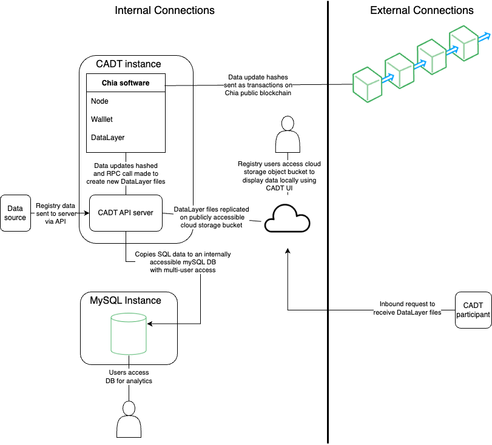
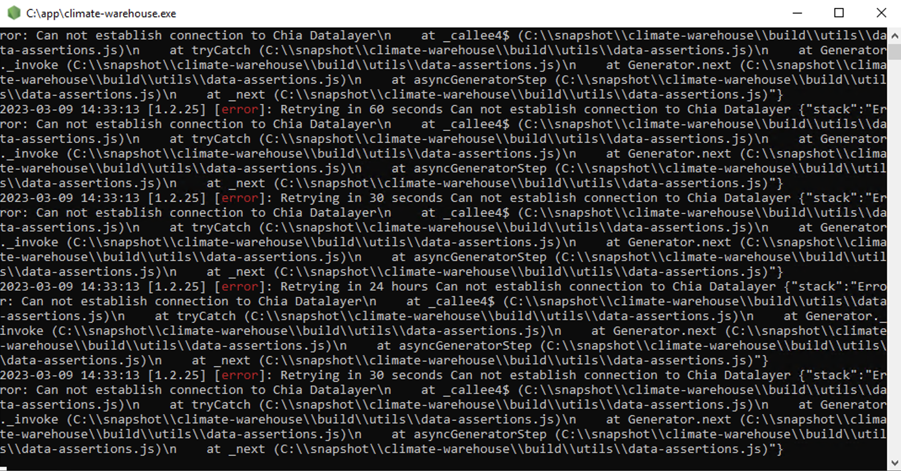
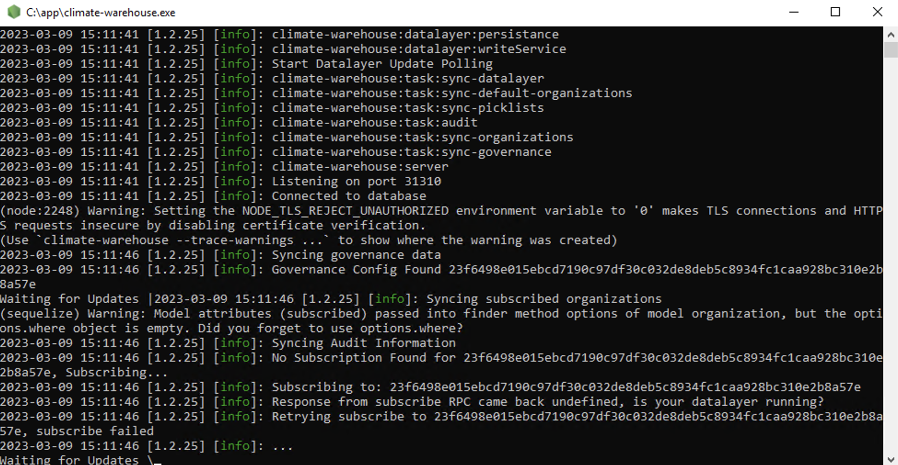

## DRAFT: Climate Action Data Trust (CADT) Remote Installation Guide

The purpose of this document is to guide you through the deployment and installation steps required to set up an instance of the CADT in a cloud or remote environment, defined as a server without a desktop GUI that is accessed over a command line. The installation will be on a remote machine and can be set up to provide UI access to multiple users in your organization.

If you are trying to set up the CADT to run on a personal computer or laptop, please reference the local installation guide. 

## Contents

* Architecture
* Installation overview
* Configure cloud file access point (AWS S3 bucket)
* Install Chia blockchain software
* Install CADT API server
* Automate services startup with systemd
* Install CADT UI (optional)
* Request XCH cryptocurrency
* Optional mySQL mirror DB

## Architecture Overview

The typical cloud architecture includes at least one cloud instance running both the Chia and CADT software, along with a cloud storage bucket and an optional MySQL server to use for analytics.

The cloud instance running Chia and CADT software will receive inbound communications from the data provider, make internal communications within the instance to create new DataLayer files, and will create a transaction on the Chia blockchain to record the new file hash.

External parties interested in the registry’s data may request the data by going to a public cloud storage bucket and receiving the DataLayer files.  This happens automatically when an external party uses the CADT software to “subscribe” to your organization.

Employees of the registry can access the data being reported to CADT in two different ways - through using a UI in read-only mode, or by using the raw data that is copied into the MySQL instance.

## Installation Overview

Deploying the CADT requires installing both the Chia blockchain software and the CADT API server software. For cloud deployments, both pieces of software are typically installed on the same machine, but can be installed on different machines and pointed to one another. For minimum machine specs, refer to the [README](https://github.com/Chia-Network/cadt#system-requirements).  

Ubuntu is the preferred OS to use as the Chia and CADT software is packaged and tested primarily with Ubuntu. Other Linux distributions should run Chia and CADT just fine, but may not be extensively tested or have packages routinely built.  Windows or Mac systems can be used to host a remote CADT instance (see the Local Installation Guide for more details), but this guide focuses on Ubuntu as our recommended solution.  

By installing both Chia and CADT onto a single machine, you will have created your cloud instance of the CADT and can begin submitting data to the instance. 

Please note that the CADT software is meant to be running 24/7. If installing with `apt` on Ubuntu, systemd can be used to manage the CADT state. See the [README](https://github.com/Chia-Network/cadt/blob/docs-updates-feb20/README.md#debian-based-linux-distros-ubuntu-mint-etc) for more information about using systemd.  

Note: the optional MySQL instance can be very small and is mainly used for internal analytics for the registry. Any of the cloud provider MySQL-compatible appliances (such as Amazon’s RDS) work well for this application. We recommend the machine for the MySQL instance to have at least:

* Single core CPU
* 1 GB ram
* 50gb disk space

## Configure File Access Point

In order for external parties to access the data you will eventually report to the cloud instance of CADT, you will need to set up a file access point. This file access point can simply be the server running Chia and CADT services, or it could be a cloud storage object such as S3. The URL of the file access point is set in the CADT config file and the files simply need to be served at that URL.   

The general idea is that the CADT creates local files to represent the data changes made. These files could be served 3 ways:

1.  Use the Chia built-in webserver
2.  Use a locally installed web server like Apache or Nginx
3.  Sync the files to cloud storage, such as Amazon S3

When using the built-in Chia DataLayer HTTP service, files will be served from the default location of `~/.chia/mainnet/data_layer/db/server_files_location_mainnet/` where the last part `mainnet` will change to the name of the network you are connected to (such at `testnet11`). This path is configurable in the Chia config file `~/.chia/mainnet/config/config.yaml`. Also configurable is the port that the DataLayer HTTP service will listen on, which is 8575 by default. Be sure this port is open when using the DataLayer HTTP service.   

First, create an S3 bucket and [give the public read access](https://docs.aws.amazon.com/AmazonS3/latest/userguide/WebsiteAccessPermissionsReqd.html). The server running Chia and CADT will need to write to this bucket, which can be done with access and secret keys from an IAM user, or, more preferably, an [instance profile](https://aws.amazon.com/premiumsupport/knowledge-center/ec2-instance-access-s3-bucket/) granting the EC2 instance access to the S3 bucket.  Be sure to capture the public URL for this S3 bucket, as you will be using it when editing the configuration file for the CADT.

Next you’ll need a script to sync the files from the Chia service up to the S3 bucket. This feature is under active development and is expected to be easier in the future, but currently the process requires installing the [official AWS CLI tool](https://aws.amazon.com/cli/), inotify-tools (`sudo apt install inotify-tools`) and then writing a custom syncing script.  We offer the [following script](https://gist.github.com/TheLastCicada/e87b618a1f25c6e1a20b81501bbf7313#file-datalayer-s3-sync) as a starting point.  The variables COMMAND and WATCHDIR will need to be altered to match the paths on your system and your S3 bucket name. By default, the path to the Chia DataLayer files that need to be synced is `~/.chia/mainnet/data_layer/db/server_files_location` for mainnet and `~/.chia/mainnet/data_layer/db/server_files_location_testnet10` when running on testnet. 

Once the datalayer-s3-sync script is configured, copy it to `/usr/local/bin/datalayer-s3-sync` and make it executable with `chmod +x /usr/local/bin/datalayer-s3-sync`.  You can then use the provided systemd file by copying it to `/etc/systemd/system/datalayer-s3-sync.service` and updating the “User” and “Group” in the datalayer-s3-sync.service file to match the user that Chia runs as on your system. Next do `sudo systemctl daemon-reload`. Now you can start the datalayer-s3-sync process with `sudo systemctl start datalayer-s3-sync` and enable it to start at boot with `systemctl enable datalayer-s3-sync`. 

## Install Chia blockchain software

To start with the installation, we suggest starting at the link below. This will give you step by step instructions to install the Chia blockchain. We recommend following the instructions for CLI only version using apt.

[https://github.com/Chia-Network/chia-blockchain/wiki/INSTALL#ubuntudebian](https://github.com/Chia-Network/chia-blockchain/wiki/INSTALL#ubuntudebian)

Once the installation is complete, you can check if it was successful by running the following commands.

**chia -h**

* Tests installation was successful, user should expect to receive help text response
    * If error, recommend logging off and logging back into the machine

**chia init --fix-ssl-permissions**

* This ensures ssl permissions are set correctly and creates the CHIA_ROOT directory at ~/.chia and populates the config file, certificates, and initial database

**chia keys generate**

* Creates new public and secret keys on the machine

**chia keys show --show-mnemonic-seed**

* Returns to the user the mnemonic seed which can be used to recover lost keys. 
* NOTE: store this mnemonic in a safe and secure location

**chia keys show**

* Returns the public address of the chia wallet that was created (look for “first wallet address”)

**chia start node wallet data**

* Starts the Chia node, wallet, and DataLayer services for use with the CADT. 
* NOTE: if this is the first time you are starting the Chia software, it may take a few minutes (up to 15 mins) to fully start up
    * Status commands listed below will not work until everything has started up. Future startups should be faster

**chia show -s**

* This will show you the full status of the node - look for the syncing status metrics
* NOTE: if this is your first time syncing, the console may show “Searching for an initial chain”. This is normal
* NOTE: it is not necessary to have a fully synced node to continue

**chia wallet show**

* This will show you the wallet balance and confirm that your wallet is synced
* NOTE: the wallet needs to be synced for the CADT server to work. The syncing is fast and should only take a few minutes 

Chia is now confirmed to be installed and running properly. You may continue to the CADT API server installation steps.

## Install CADT API server

To begin the installation of the CADT API server, it is recommended to follow the full instructions for the CADT at the link below.

[https://github.com/Chia-Network/cadt#debian-based-linux-distros-ubuntu-mint-etc](https://github.com/Chia-Network/cadt#debian-based-linux-distros-ubuntu-mint-etc)

Once installed, run the CADT executable by entering

`/opt/cadt/cadt`  

The executable will run in the foreground of your terminal window and display a bunch of output. If Chia services are not running properly, you will see messages similar to the below:

Please go back and check that all your Chia services are running properly. 

The terminal window should print some success messages relating to finding governance data. This should look something like the below:

There should be messages saying “governance config found” and data is being downloaded.

When you successfully run cadt, it will create the config file at /.chia/mainnet/cadt/v1/config.yaml.  The configuration file options are documented at [https://github.com/Chia-Network/cadt#configuration](https://github.com/Chia-Network/cadt#configuration).  

If you chose to set up a cloud storage object like the AWS S3 bucket, then you should use the public URL for the cloud storage object as the value for configuration variable “DATALAYER_FILE_SERVER_URL”.

The cadt executable needs to be restarted to pick up any changes to the config.yaml file, which can be done with ctrl+c in the terminal window where cadt is running and then simply starting the executable again.

## Automate services startup with systemd

If you have followed the above instructions, you may want to automatically start the Chia and CADT services upon machine reboot/startup. Instructions for Chia services are as follows:

Start by downloading the systemd templates (daemon, full-node, wallet, data-layer) by doing:

**sudo curl https://raw.githubusercontent.com/Chia-Network/ansible-roles/chia-blockchain/templates/systemd/chia-daemon.service.j2 -o /etc/systemd/system/chia-daemon.service**

**sudo curl https://raw.githubusercontent.com/Chia-Network/ansible-roles/chia-blockchain/templates/systemd/chia-full-node.service.j2 -o /etc/systemd/system/chia-full-node.service**

**sudo curl https://raw.githubusercontent.com/Chia-Network/ansible-roles/chia-blockchain/templates/systemd/chia-wallet.service.j2 -o /etc/systemd/system/chia-wallet.service**

**sudo curl https://raw.githubusercontent.com/Chia-Network/ansible-roles/chia-blockchain/templates/systemd/chia-data-layer.service.j2 -o /etc/systemd/system/chia-data-layer.service**

Next, edit each file, following along the comments in each.

Once complete, do

**sudo systemctl daemon-reload** 

This will update systemd with the latest changes. Do this every time you make a change to any of the chia.service files.

Next, do the following commands

**sudo systemctl start chia-daemon**

to start the Chia daemon

**sudo systemctl start chia-full-node**

to start the Chia full-node

**sudo systemctl start chia-wallet**

to start the Chia wallet

**sudo systemctl start chia-data-layer**

to start the Chia data-layer

**sudo systemctl status chia-[service]**

to ensure each Chia service is running successfully (Look for Active: active (running))

**sudo systemctl enable chia-[service]** 

to set each Chia service to run at boot

Instructions for CADT services can be found at the link below:

[https://github.com/Chia-Network/cadt#systemd-init-script](https://github.com/Chia-Network/cadt#systemd-init-script)

Please note that while this is the recommended approach to interacting with the software in a cloud environment, this is not necessary. If you need to reboot or restart your cloud environment, you can simply restart Chia and CADT services manually instead.

## Install CADT UI (optional)

Based on your organizational use case, you may or may not need to consider the [CADT UI](https://github.com/Chia-Network/climate-warehouse-ui). The CADT UI is useful for visualizing the data that is entered into the CADT, but presumably the data will be visible on the public observer node. 

The CADT UI is a javascript application that connects to the CADT API.  It is offered as a desktop application packaged with Electron, or as a web application.  If running as a web application, most organizations will host the UI on the same server as the CADT API or in a public S3 bucket.  Alternatively, each user can run the desktop application on their workstation and connect to the single CADT API.  In either scenario, the CADT API must be connectable from the user’s workstation, which usually means making it publicly available on port 31310.  Additional installation instructions can be found in the README of the Github repo [https://github.com/Chia-Network/climate-warehouse-ui](https://github.com/Chia-Network/climate-warehouse-ui). 

When making your CADT API public, take care to set up an API_KEY to prevent unauthorized access.  Alternatively, the CADT API can be run in READ_ONLY mode, which only exposes data publicly available on the blockchain.  Set the API_KEY by editing the configuration file on your instance that is running the CADT API server. Users will connect to the CADT UI server and enter the “API_KEY” to authenticate their session to the CADT API server. 

The users will be able to see the data that is being submitted to the CADT.

## Obtain XCH cryptocurrency

Now that the software has been set up on your cloud machine, you are nearly able to use the CADT functionality, but first you will need to obtain some Chia cryptocurrency. Each update to the blockchain will require a small amount of cryptocurrency to be spent for creating tokens or paying the small fees to write to the chain. The amount of cryptocurrency a registry will need to obtain depends on the frequency of data updates. Typically, it is expected that 0.1 XCH will be sufficient for a year of data updates.

The [Chia faucet](https://faucet.chia.net/) can provide a small amount of mojos (the term for fractional amounts of XCH) to get started with.  There are a number of ways to [buy XCH](https://www.chia.net/buy-xch/) and it is offered on many global exchanges. 

On the instance running the Chia and CADT software, you can do the following command to see your wallet address:

**chia wallet get_address**

This will return a public wallet address for you to use in obtaining XCH. You can be sure you have received XCH by doing

**chia wallet show**

And you will see your balance of XCH.

## Optional MySQL mirror DB

One additional server can be added to this setup in order to mirror the CADT DB structure into a multi-user access database such as mySQL. This is useful for analytics on the data that is reported to the CADT ecosystem - this database will have both the data the registry owns, along with the data other registries have provided.

We recommend the machine for the MySQL instance to have at least:

* Single core CPU
* 2 GB ram
* 50gb diskspace

We recommend using a separate instance from the one running Chia and CADT API services as the MySQL database is designed to provide easy access to multiple users and generally you’ll want your Chia server to have more restricted access.  . 

Start by installing MySQL on the instance or using a cloud MySL appliance like Amazon RDS. 

You will need to point the CADT API server to mirror the database to the mySQL server DB. You can do this by changing the configuration file for the CADT API server. More information about configuration variables can be found at [https://github.com/Chia-Network/cadt#configuration](https://github.com/Chia-Network/cadt#configuration) 

Once the CADT API server has been restarted, confirm the mirror process is working by checking the output of the CADT API server, as well as checking to see if the mirror DB server is receiving data.
